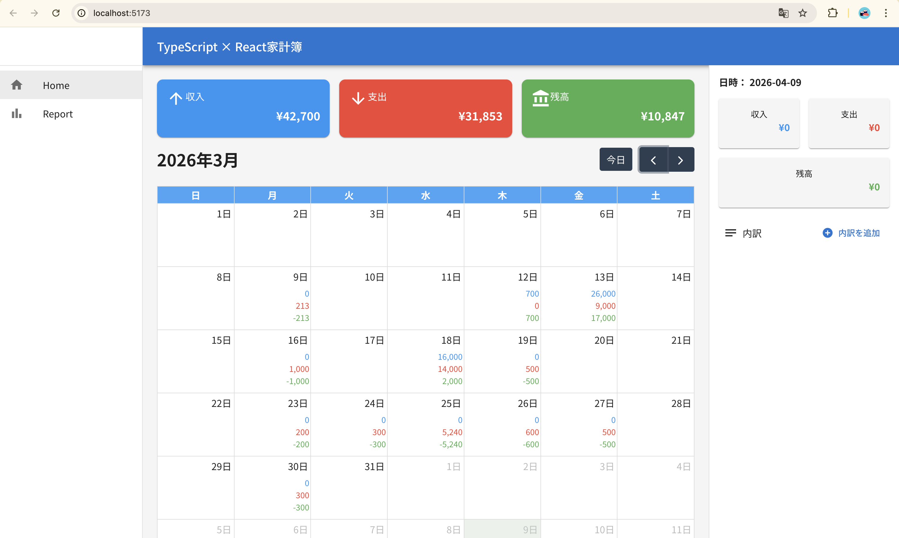
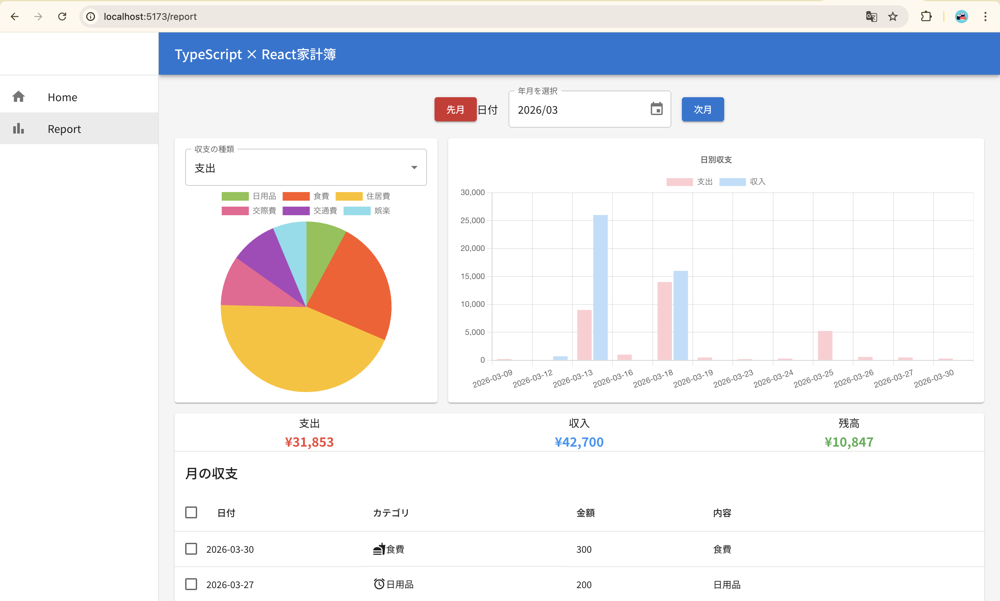

# 家計簿アプリ（Udemy 教材ベース）

本リポジトリは Udemy の家計簿アプリ教材をもとに、**Vite**・**React**・**TypeScript**・**MUI v7**・**React Router v7**・**Firebase（Firestore）** で構築した Web アプリです。

ホームではカレンダーで月を切り替えたり日付を選んだりしながら、その日の取引を一覧・登録・編集・削除できます。レポート画面では Chart.js を用いて収支をグラフ表示します。共通レイアウトは AppBar とサイドバーから「ホーム」「レポート」へ遷移し、テーマでは収入・支出・残高を色分けするパレットを定義しています。

アプリ全体の状態は React Context で共有し、フォームは React Hook Form と Zod、単体・結合テストは Vitest、E2E は Playwright を利用しています。本番公開は Firebase Hosting を想定しています。




## 必要な環境

- [Node.js](https://nodejs.org/)（LTS 推奨）

## セットアップ

プロジェクトのルートで依存関係をインストールします。

```bash
npm install
```

## よく使うコマンド

プロジェクトのディレクトリで次を実行できます。

### `npm run dev`

開発サーバーを起動します。ブラウザで [http://localhost:5173](http://localhost:5173) を開いて確認してください（Vite のデフォルトポート）。

ファイルを保存するとホットリロードされます。

### `npm run build`

本番用にビルドし、成果物は `dist` フォルダに出力されます。

### `npm run preview`

ビルド結果をローカルでプレビューします。先に `npm run build` を実行してください。

### `npm test`

[Vitest](https://vitest.dev/) でテストを実行します。テスト方針のメモは [`docs/testing.md`](docs/testing.md) を参照してください。

## デプロイ（Firebase Hosting）

`firebase.json` で `public` が `dist` に設定されている場合の例です。

```bash
npm run build
firebase deploy --only hosting
```

Firebase CLI のログインやプロジェクト選択（`firebase use` など）は事前に済ませてください。
